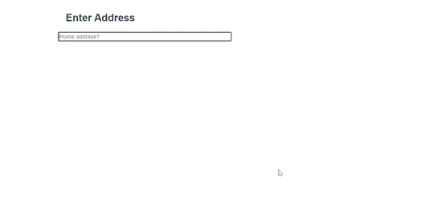

# ReactJS - Address Autosuggest

An ReactJS based Address component which uses Google Maps Places API to autosuggest location address.

## Table of contents

- [Browser Support](#browser-support)
- [Demo](#demo)
- [Installation](#installlation)
- [Getting started](#getting-started)
- [Usage](#usage)
- [Available Props](#available-props)
- [Methods](#methods)
- [Want to Contribute?](#want-to-contribute)
- [Collection of Components](#collection-of-components)
- [Changelog](#changelog)
- [Credits](#credits)
- [License](#license)
- [Keywords](#Keywords)

## Browser Support

|  |  |  |  |  |
| ---------------------------------------------------------------------------------------- | ------------------------------------------------------------------------------------------- | ---------------------------------------------------------------------------------------- | ---------------------------------------------------------------------------------- | ---------------------------------------------------------------------------------------------------------------------------- |
| 83.0 ✔                                                                                   | 77.0 ✔                                                                                      | 13.1.1 ✔                                                                                 | 83.0 ✔                                                                             | 11.9 ✔                                                                                                                       |

## Demo

[](https://github.com/weblineindia/ReactJS-Address-Autosuggest/address.gif)

## Installation

This component uses Google Maps Places API to get geo suggests for autocompletion, so you have to include the Google Maps Places API in the `<head>` of your HTML:

```html
<!DOCTYPE html>
  <html>
  <head>
    …
    <script src="https://maps.googleapis.com/maps/api/js?key=YOUR_API_KEY_HERE&libraries=places"></script>
  </head>
  <body>
    …
  </body>
</html>
```

To obtain API key please visit the [Google Developer Console](https://console.developers.google.com). The API's that you have to enable in your Google API Manager Dashboard are [Google Maps Geocoding API](https://developers.google.com/maps/documentation/geocoding/start), [Google Places API Web Service](https://developers.google.com/places/web-service/) and [Google Maps Javascript API] (https://developers.google.com/maps/documentation/javascript/).

## Getting started

Install the npm package:

``` bash
npm install react-weblineindia-address
#OR
yarn add react-weblineindia-address
```

## Usage

Use the `<react-weblineindia-address>` component:

```js
import React, { Component } from "react";
import Address from "react-weblineindia-address";
class Test extends Component {
     constructor(props) {
    super(props);
    this.state = {
         selectedAddressData: [],
          errors: {},
          address: [{ address: "" }],
    }
    /**
   * This method is used to get country detail
   */
  handleSelectSuggest = (e, value, key, searchValue) => {
    debugger;
    let selectedAddress = this.state.selectedAddressData;
    if (selectedAddress.length > 0) {
      selectedAddress[key].isSelectedAddress = true;
    }
    if (selectedAddress.length === 0) {
      let selectedAddressfields = { isSelectedAddress: true };
      selectedAddress.push(selectedAddressfields);
    }
    let data = this.state.address;
    data[key].address = e;
    data[key].search = "";

    this.setState({ address: data, selectedAddressData: selectedAddress });
    if (this.state.address.length > 1) {
      let results = [];
      for (let i = 0; i < this.state.address.length - 1; i++) {
        for (let j = i + 1; j < this.state.address.length; j++) {
          if (
            this.state.address[i].address.toLowerCase() ===
            this.state.address[j].address.toLowerCase()
          ) {
            if (this.state.address[i].address.trim().length > 0) {
              results.push(this.state.address[i]);
            }
          }
        }
      }
      let errors = this.state.errors;

      if (results.length > 0) {
        errors["sameAddressError"] = "Do not enter same Address";
      } else {
        errors["sameAddressError"] = "";
      }
      this.setState({ errors: errors });
    }
  };

   /**
   * This method used to new field
   * @param e
   * @param value
   */
  onPlusClick(e, value, i) {
    let selectedAddressData = this.state.selectedAddressData;
    let selectedAddressD = { isSelectedAddress: false };
    selectedAddressData.push(selectedAddressD);
    this.state.address.push({
      address: "",
    });
    this.setState({ selectedAddressData });
  }
   /**
   * This Method is used for Blur input
   * @param {*} event 
   */
  onBlurInput(event) {
    event.target.placeholder = "Address";
  }
  /**
   * This method is used for focus input
   * @param {*} event 
   */
  onFocusInput(event) {
    debugger;
    event.target.placeholder = "";
  }
   /**
   * This method is used to get address field value
   * @param e
   * @param value
   * @param key
   * @param searchValue
   */
  onHandleAddressChange(e, value, key, searchValue) {
    let data = this.state.address;
    data[key].address = e;
    data[key].search = e;

    let selectedAddressData = this.state.selectedAddressData;
    if (e === "") {
      if (selectedAddressData.length > 0) {
        selectedAddressData[key].isSelectedAddress = false;
      }
    }
    this.setState({ address: data });
  }
    render(){
        return(
           <div>
        {this.state.address &&
          this.state.address.map((cdiv, i) => {
            return (
              <div id="address">
                <PlaceAddress
                  index={i}
                  tabIndex={0}
                  streetPlaceholder="Street Number"
                  value={cdiv.address}
                  onChange={(e) => {
                    this.onHandleAddressChange(e, "address", i, "search");
                  }}
                  placeholder="Address"
                  className={
                    (
                      cdiv.address === undefined
                        ? cdiv
                        : cdiv.address.length > 0
                    )
                      ? "location-search-input form-control textvisible"
                      : "location-search-input form-control"
                  }
                  id={"search" + i + "Txt"}
                  elmkey="address"
                  onFocus={(e) => {
                    this.onFocusInput.bind(this);
                  }}
                  onBlur={(e) => {
                    this.onBlurInput.bind(this);
                  }}
                  country="in"
                  onSelect={(e) => {
                    this.handleSelectSuggest(e, "address", i, "search");
                  }}
                />
                <React.Fragment className="add-remove">
                  <React.Fragment >
                    <div className="add-minus">
                      <i className="fa fa-minus" aria-hidden="true"></i>
                    </div>
                  </React.Fragment>
                  {this.state.address.length - 1 === i ? (
                    <div>
                      <i
                        className="fa fa-plus"
                        aria-hidden="true"
                        onClick={this.onPlusClick.bind(this)}
                      ></i>
                    </div>
                  ) : (
                    ""
                  )}
                </React.Fragment>
                {this.state.errors["sameAddressError"] ? (
                  <p>
                    <span className="error-msg">
                      {this.state.errors["sameAddressError"]}
                    </span>
                  </p>
                ) : (
                  ""
                )}
              </div>
            );
          })}
      </div>
        )
    }
}
export default Test;
```

## Available Props

| Prop | Type | default | Description |
| --- | --- | --- | --- |
| id | String |   |ID for the input container |
| name | String |   |Name of the component |
| value | Array |  address: [ {address: "", geolocation: { x: 0, y: 0 }, country: "",locality: "",postalcode: "", state: "",province: "",fulladdress: "", streetaddress: "",isDuplicate: false}]  | Value of the component |
| classname | String |   |  Class to the input container |
| streetPlaceholder | String |   | The input field will get this placeholder text |
| isShowStreetField | Boolean | false  | hide /show street number field |
| placeholder | String |   | The input field will get this placeholder text ||
| country | `Array` | null  |  Option to restrict the autocomplete search to a particular country. Countries must be passed as a two-character, ISO 3166-1 Alpha-2 compatible country code (i.e. "br", "sg", "fr"). You can provide a single one, or an array of up to 5 country code strings. |
| hide | Boolean | false  | Hide component  |
| disabled | Boolean | false  | Disable component  |
| tabindex | Number |   | Tab index of the component  |
| index | Number |   | Add key of the component  |
| maxlength | Number |   | The input maxlength  |

## Methods

| Name | Description |
| --- | --- |
| focus | Gets triggered when the autocomplete input field receives focus. |
| blur | Gets triggered when the autocomplete input field loses focus. |
| inputChange | Gets triggered every time autocomplete input got changed. |
| onMultipleAddressAdd | Gets triggered every time when add plus icon  |
| change | Gets triggered when the autocomplete results got changed. |
| keypress | Gets triggered when a key gets pressed. |
| error | Gets triggered when an error is encountered. |
| placechanged | Gets triggered when the address data got obtained. This data is available on the returned objects: `street_number`,`route`, `locality`, `administrative_area_level_1`, `country`, `postal_code`, `latitude`, `longitude`. `place` - [PlaceResult object](https://developers.google.com/maps/documentation/javascript/reference#PlaceResult) is available as second parameter.`id` a String representing the ID of the autocomplete that triggered the event. |

## Want to Contribute?

- Created something awesome, made this code better, added some functionality, or whatever (this is the hardest part).
- [Fork it](http://help.github.com/forking/).
- Create new branch to contribute your changes.
- Commit all your changes to your branch.
- Submit a [pull request](http://help.github.com/pull-requests/).

-----

## Collection of Components
We have built many other components and free resources for software development in various programming languages. Kindly click here to view our [Free Resources for Software Development](https://www.weblineindia.com/software-development-resources.html )

------

## Changelog

Detailed changes for each release are documented in [CHANGELOG.md](./CHANGELOG.md).

## Credits

react-weblineindia-address is inspired by [React Places Autocomplete](https://www.npmjs.com/package/react-places-autocomplete).

## License

[MIT](LICENSE)

[mit]: https://github.com/weblineindia/ReactJS-Address-Autosuggest/blob/master/LICENSE

## Keywords

react-weblineindia-address, react-address, reactjs-address, react-autocomplete, react-google-place, react-google-maps-places, google-maps-places-api
